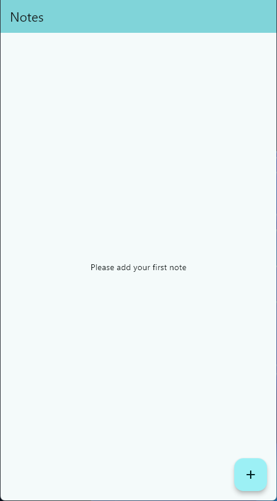
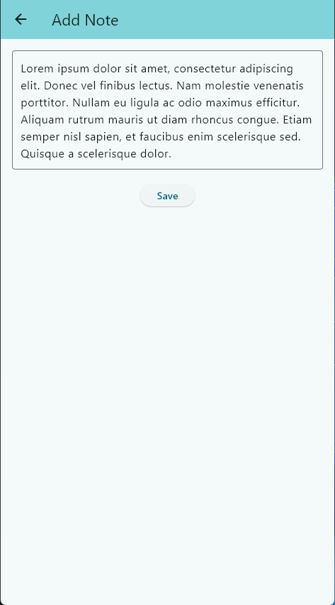
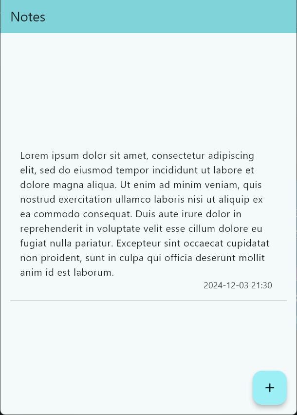

# Flutter Notes 

Flutter Notes is a simple note-taking application built with Flutter. It allows users to create and store their notes. 

## Tech Stack 🚀
- Flutter Bloc
- Hive
- Freezed
- Get It
- Auto Route
- Injectable
- Path Provider
- Intl
- Clean Architecture
- Mockito
- Bloc Test

## Screenshots

Below are screenshots taken directly from the application.
<table width="100%">
  <tbody>
    <tr>
      <td width="1%"></td>
      <td width="1%"></td>
      <td width="1%"></td>
    </tr>
  </tbody>
</table>

## Setup

Run the following commands from your terminal:

1) `git clone https://github.com/wieczorek0807/flutter_notes.git` to clone this repository.
2) `flutter pub get` in the project root directory to install all the required dependencies.
3) `flutter pub run build_runner build --delete-conflicting-outputs` to generate Freezed files.